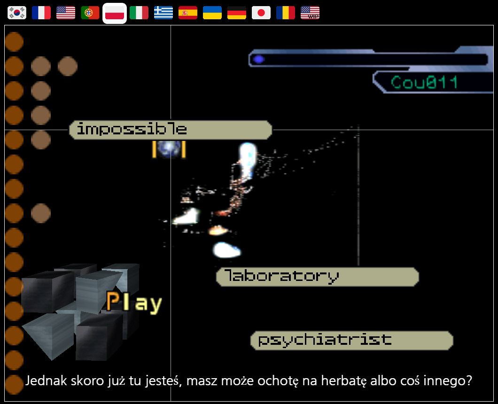
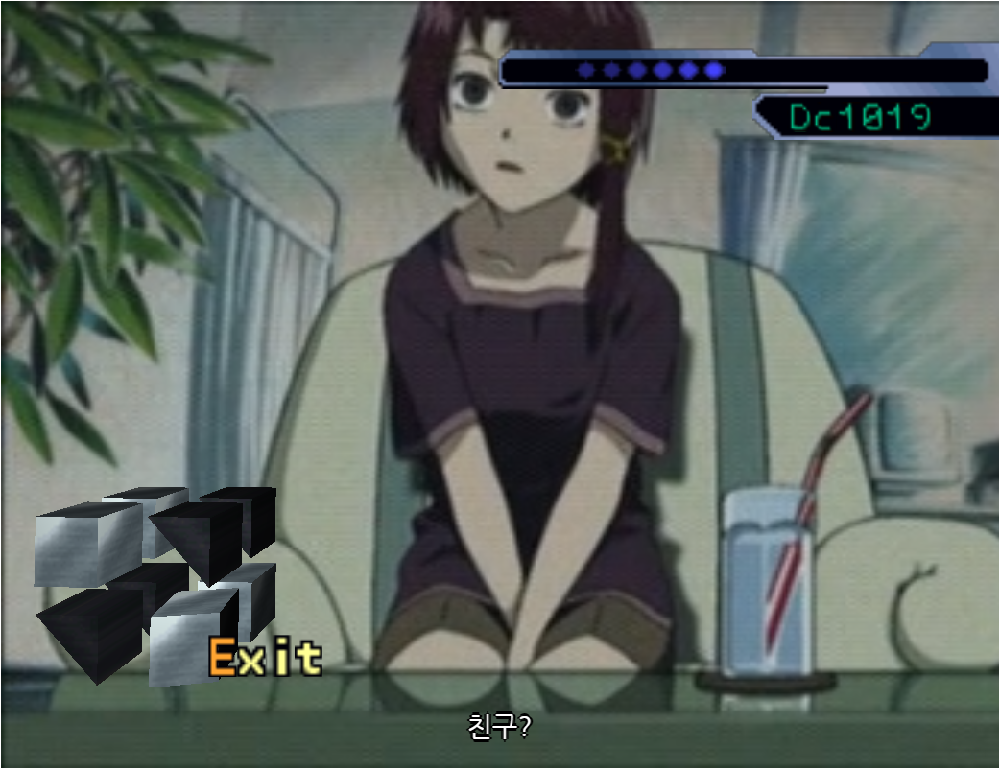
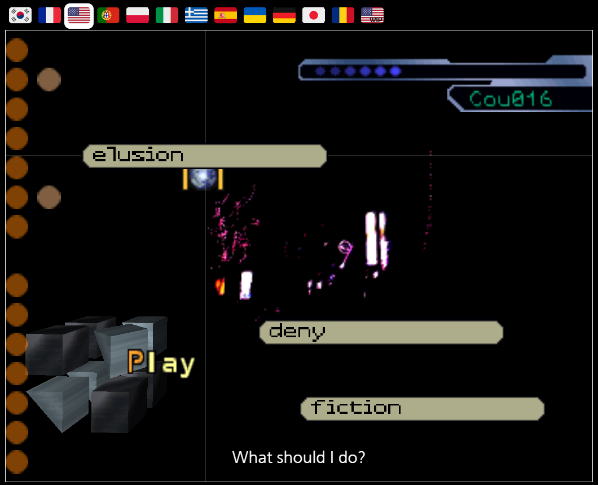
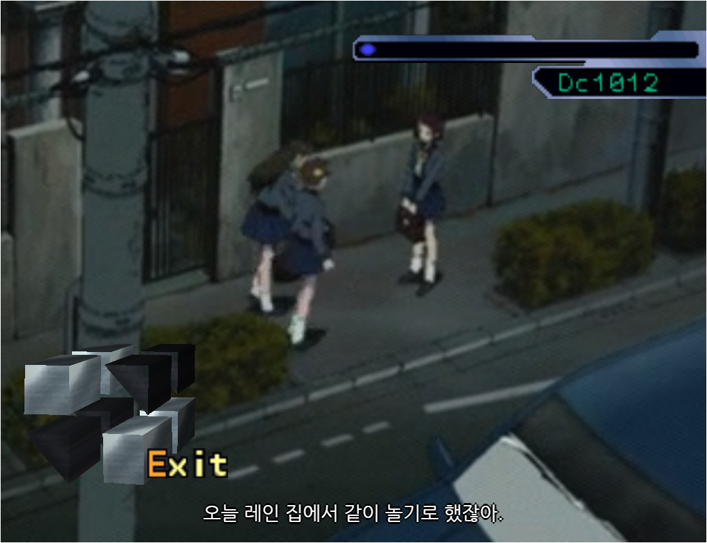

# Info
web script lain은 1999년에 출시한 serial experiments Lain의 PS1 게임을 웹으로 즐길 수 있게 이식된 [LainTSX](https://github.com/ad044/lainTSX)를 한국어로 즐기기 위한 웹 스크립트입니다.
현재 한국어 번역은 52% 가량 완료되었습니다.

## Usage
확장프로그램을 지원하는 브라우저(chrome, fireforx, vivaldi 등)에서 [Tampermonkey](https://www.tampermonkey.net) 설치 후 대시보드-도구-Install from URL에 https://raw.githubusercontent.com/CyleAR/web-script-lain/master/main.js 를 입력하여 설치한 뒤 게임을 즐겨주시면 됩니다.

## Credits
* [Karuhaku](https://twitter.com/karuhaku) 및 그 외 - 번역 및 감수
* [lelenium](https://github.com/lelenium) - vtt 자막 제공

### Screenshots

  
  
  
  

