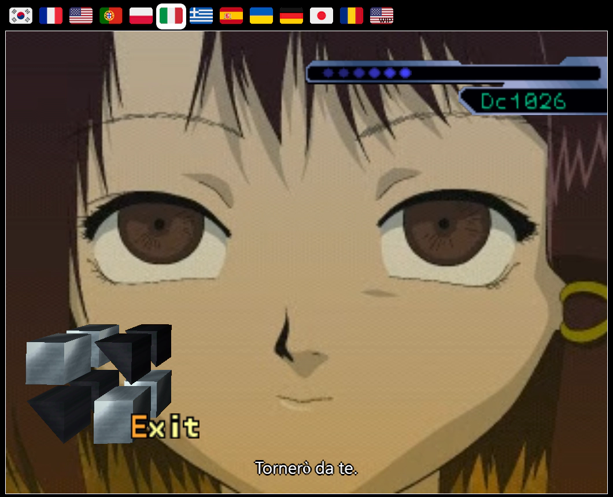
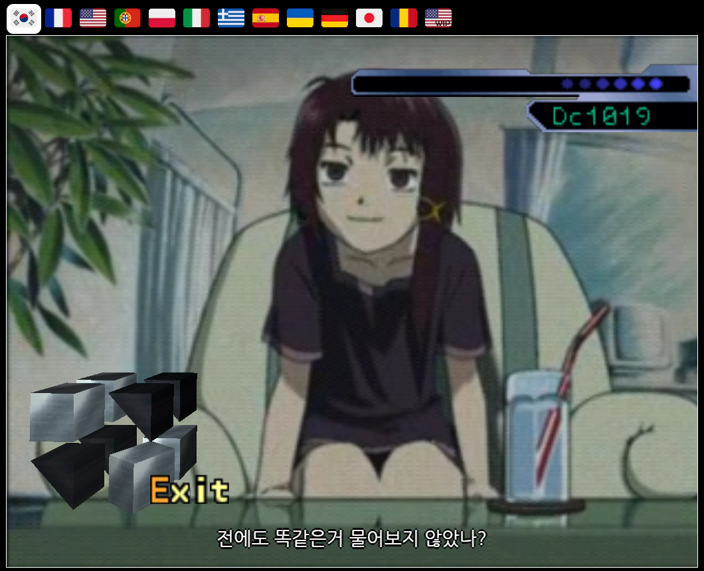

# Info
**web-script-lain**은 1998년에 출시한 serial experiments lain의 PS1 게임을 웹으로 즐길 수 있게 이식된 [LainTSX](https://laingame.net)를 다국어로 즐기기 위한 유저 스크립트입니다.
현재 한국어 번역은 99.99% 가량 완료되었습니다.

**web-script-lain** is an userscript for multilingual support on [LainTSX](https://laingame.net). All translations are from [here](https://crowdin.com/project/lain-psx).

## Usage
1. 확장프로그램을 지원하는 브라우저(chrome, firefox, vivaldi 등)에서 [Tampermonkey](https://www.tampermonkey.net) 설치  
2. Tampermonkey의 대시보드-도구-Install from URL에 https://raw.githubusercontent.com/CyleAR/web-script-lain/master/korean.js 를 입력  
3. 스크립트 설치 후 [LainTSX](https://laingame.net)에서 상단의 '시작'을 눌러 플레이 시작
---
1. Install [Tampermonkey](https://www.tampermonkey.net) into your web brower  
2. Move to Dashboard - Utilites - Install from URL  
3. Copy&Paste https://raw.githubusercontent.com/CyleAR/web-script-lain/master/main.js to box and click Install button
4. After Installing the script, select locale and play [LainTSX](https://laingame.net)

## Screenshots

  
  
  
  

## Credits
* [Karuhaku](https://twitter.com/karuhaku) - 초벌번역 및 감수
* [lelenium](https://github.com/lelenium) - vtt 자막 제공
* [번역 프로젝트](https://crowdin.com/project/lain-psx)에 참여해준 모두 - 다국어 번역 제공

## Special Thanks
* [LainTSX](https://github.com/ad044/lainTSX) 팀원 모두
* [Reflection](https://github.com/reflection1921) 자바스크립트 도움 제공
